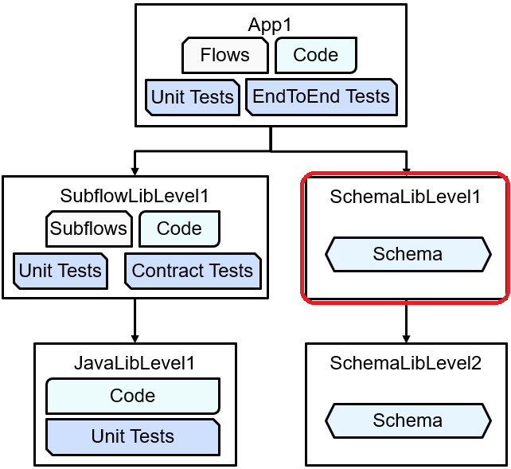

# ace-submodule-schemalib-level1

ACE submodule schema library level1

This is a mid-level library in a hierarchy of repositories:

App library: https://github.com/trevor-dolby-at-ibm-com/ace-submodule-app1

Schema library 2: https://github.com/trevor-dolby-at-ibm-com/ace-submodule-schemalib-level2

Originally created for a [blog post](https://community.ibm.com/community/user/integration/blogs/trevor-dolby/2023/04/03/automated-multi-repo-app-connect-enterprise-ace-ba).

This repo is intended to be used as part of the application itself, and not 
as an independent ACE object. 

Update submodule with `git submodule update --remote --merge --recursive`
